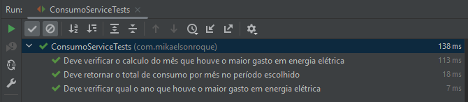

<h1>Calculo Gasto Mensal - PLANO CONSULTORIA</h1>

______

<h3>Projeto criado para armazenar o código fonte para uma tarefa proposta para o processo seletivo da empresa Plano Consultoria.

______

Foi utilizada a linguagem JAVA e a técnica do TDD além de algus recursos do ecossisteema Spring para desenvolvimento do projeto em duas camadas

______

<h2> TESTES REALIZADOS:

